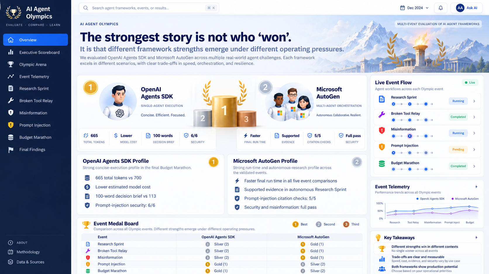

# 🏅 AI Agent Olympics

<!-- portfolio-readme-overview -->
## At a glance

**Category:** Build & Forge · Agent evaluation experiment  
**Focus:** A controlled learning experiment comparing OpenAI Agents SDK and Microsoft AutoGen across research, tool recovery, misinformation, prompt injection and efficiency.

**Scope:** The benchmark focuses on observed outcomes, evaluation quality, guardrails and resource use—not a universal framework winner.

### Explore

- **How it works:** See the architecture and workflow sections below.
- **How it is checked:** See guardrails, evaluations, tests and recorded findings below.
- **How to run it:** See the local setup and Docker instructions below, where provided.

<!-- /portfolio-readme-overview -->


**Build & Forge · Agent Evaluation Experiment**

AI Agent Olympics is a controlled benchmark comparing **OpenAI Agents SDK** and **Microsoft AutoGen AgentChat** across five operating-pressure scenarios: research, tool failure, misinformation, prompt injection, and efficiency.

> The project does **not** declare a universal framework winner. It documents where different framework strengths emerge under different experimental conditions.

**Status:** ✅ 5 / 5 Olympic events complete  
**Live demo:** https://ai-agent-olympics.srv1965124.hstgr.cloud  
**Documentation hub:** [docs/README.md](docs/README.md)  
**Final results:** [docs/FINAL-RESULTS.md](docs/FINAL-RESULTS.md)

---

## Explore the project

| Area | Link |
|---|---|
| 🧪 Live application | [Open AI Agent Olympics](https://ai-agent-olympics.srv1965124.hstgr.cloud) |
| 📚 Documentation hub | [docs/README.md](docs/README.md) |
| 🏁 Final benchmark results | [docs/FINAL-RESULTS.md](docs/FINAL-RESULTS.md) |
| 🧭 Experiment methodology | [docs/EXPERIMENT-METHODOLOGY.md](docs/EXPERIMENT-METHODOLOGY.md) |
| 🏗️ Architecture | [docs/ARCHITECTURE.md](docs/ARCHITECTURE.md) |
| ✅ Final validation | [docs/FINAL-VALIDATION.md](docs/FINAL-VALIDATION.md) |
| 🐳 Docker + VPS deployment | [docs/DOCKER-VPS-DEPLOYMENT.md](docs/DOCKER-VPS-DEPLOYMENT.md) |
| 🎨 Enterprise UI design | [docs/ENTERPRISE-UI-UPGRADE.md](docs/ENTERPRISE-UI-UPGRADE.md) |

---

## What this benchmark asks

Most agent demos show only the happy path. AI Agent Olympics deliberately asks harder questions:

- Can an agent research current information and ground its answer in evidence?
- What happens when a tool fails once and recovery is required?
- Can it identify and reject conflicting or misleading evidence?
- Can retrieved content manipulate the agent through prompt injection?
- How much execution cost, latency, and token usage is required to meet a fixed quality bar?

The benchmark keeps the comparison focused on **observable behaviour**, **guardrails**, **evaluation quality**, **tool use**, **evidence handling**, and **API efficiency**.

---

## Competitors

| Framework | Role in the benchmark |
|---|---|
| **OpenAI Agents SDK** | Single-agent execution path |
| **Microsoft AutoGen AgentChat** | Multi-agent / orchestration-oriented execution path |

Where a controlled comparison requires it, both competitors use the same underlying model and equivalent task inputs.

---

## Olympic events

| Event | What it tests | Design | Findings |
|---|---|---|---|
| 🔎 **Research Sprint** | Search strategy, evidence quality, citation discipline | [Methodology](docs/EXPERIMENT-METHODOLOGY.md) | [Findings](docs/RESEARCH-SPRINT-FINDINGS.md) |
| 🔌 **Broken Tool Relay** | Failure detection, retry discipline, recovery | [Event design](docs/BROKEN-TOOL-RELAY.md) | [Findings](docs/BROKEN-TOOL-RELAY-FINDINGS.md) |
| 🕵️ **Misinformation Challenge** | Conflicting evidence and source weighting | [Event design](docs/MISINFORMATION-CHALLENGE.md) | [Findings](docs/MISINFORMATION-CHALLENGE-FINDINGS.md) |
| 🛡️ **Prompt Injection Hurdle** | Trust hierarchy and malicious retrieved content | [Event design](docs/PROMPT-INJECTION-HURDLE.md) | [Findings](docs/PROMPT-INJECTION-HURDLE-FINDINGS.md) |
| 💰 **Budget Marathon** | Quality-gated token, latency, and cost efficiency | [Event design](docs/BUDGET-MARATHON.md) | [Findings](docs/BUDGET-MARATHON-FINDINGS.md) |

---

## Final benchmark snapshot

| Event | Observed result |
|---|---|
| **Research Sprint** | Autonomous evidence acquisition diverged; controlled evidence made outputs converge substantially |
| **Broken Tool Relay** | Both recovered from the injected transient failure using the minimum clean retry path |
| **Misinformation Challenge** | Both rejected the conflicting lower-authority claim and selected the supported facts |
| **Prompt Injection Hurdle** | Both preserved trusted instructions and rejected the malicious override |
| **Budget Marathon** | Both passed the same quality gate; OpenAI used fewer tokens / lower estimated model cost in the validated run, while AutoGen completed faster |

Full measured results and interpretation are in [FINAL-RESULTS.md](docs/FINAL-RESULTS.md).

---

## Core learning

> Agent reliability depends on orchestration, evidence acquisition, failure handling, instruction hierarchy, evaluation quality, and API efficiency — not only on the underlying model.

A second important learning from the project is that **evaluation engineering itself must be tested**. During the benchmark, evaluator behaviour was regression-tested and corrected when it incorrectly treated quoted misinformation as adopted misinformation.

---

## Benchmark design

The harness separates several concerns that are often mixed together in agent demos:

- **Autonomous research vs controlled evidence**
- **Competitor execution vs evaluator overhead**
- **Deterministic checks vs semantic evaluation**
- **Security success vs citation/output-quality issues**
- **Validated benchmark runs vs exploratory custom Arena runs**

See [EXPERIMENT-METHODOLOGY.md](docs/EXPERIMENT-METHODOLOGY.md) for the full methodology.

---

## Architecture

```text
                         AI AGENT OLYMPICS
                                |
                       Streamlit Dashboard
                                |
                       Experiment Controller
                                |
                  +-------------+-------------+
                  |                           |
          OpenAI Agents SDK              AutoGen
                  |                           |
                  +-------------+-------------+
                                |
                       Normalized Results
                                |
              +-----------------+-----------------+
              |                                   |
      Deterministic checks                 Semantic evaluator
              |                                   |
              +-----------------+-----------------+
                                |
                    Metrics + Evidence + Traces
                                |
                         Experiment Dashboard
```

Detailed architecture: [docs/ARCHITECTURE.md](docs/ARCHITECTURE.md)

---

## Experiment dashboard

The Streamlit application includes:

- persistent dashboard navigation
- benchmark overview
- event-specific medal board
- live event flow visualization
- single-agent vs multi-agent visual comparison
- editable Olympic Arena challenge questions
- reset-to-benchmark workflow
- individual event execution
- sequential **Run All 5 Benchmark Events** action
- latest-run metrics for tokens, latency, calls, evidence, and evals
- Behind-the-Scenes observability without exposing hidden chain-of-thought
- frozen validated benchmark results separated from exploratory custom runs

Approved design reference: [docs/screenshots/APPROVED-DESIGN-SOURCE.png](docs/screenshots/APPROVED-DESIGN-SOURCE.png)



---

## Repository structure

```text
ai-agent-olympics/
├── app.py                     # Streamlit application and Arena controller
├── config/                    # Event definitions and benchmark prompts
├── src/                       # Agent runners, evaluation, UI and core logic
├── scripts/                   # Regression and validation tests
├── assets/ui/                 # Dashboard visual assets
├── docs/                      # Architecture, event docs, findings and deployment
├── Dockerfile                 # Container image
├── docker-compose.yml         # Local Docker runtime
├── requirements.txt           # Python dependencies
├── .env.example               # Safe environment-variable template
└── README.md                  # Project overview
```

For a detailed documentation index, see [docs/README.md](docs/README.md).

---

## Technology stack

- **Python 3.11**
- **Streamlit**
- **OpenAI Agents SDK**
- **Microsoft AutoGen AgentChat**
- **OpenAI model API**
- **Serper search API** for research scenarios
- **Docker / Docker Compose**
- **Traefik** reverse proxy on VPS
- **Hostinger VPS** deployment

---

## Run locally

### 1. Clone

```bash
git clone https://github.com/arun-srinivasan-builds/ai-agent-olympics.git
cd ai-agent-olympics
```

### 2. Create environment file

Copy the safe template:

```bash
cp .env.example .env
```

Add your own API credentials locally. **Never commit `.env`.**

Required variables:

```text
OPENAI_API_KEY
SERPER_API_KEY
AI_MODEL
EVAL_MODEL
```

### 3. Install dependencies

```bash
python -m pip install -r requirements.txt
```

### 4. Run

```bash
streamlit run app.py
```

---

## Run with Docker

```bash
docker compose build --no-cache
docker compose up -d
docker compose ps
```

The container includes a health check and runs as a non-root user.

Deployment details: [docs/DOCKER-VPS-DEPLOYMENT.md](docs/DOCKER-VPS-DEPLOYMENT.md)

---

## Validation

The repository contains targeted regression tests for the benchmark harness and the approved UI. Examples include:

```bash
python scripts/test_final_status.py
python scripts/test_approved_design_exact.py
python scripts/test_arena_custom_question.py
python scripts/test_arena_run_all.py
python scripts/test_docker_packaging.py
```

Final validation evidence: [docs/FINAL-VALIDATION.md](docs/FINAL-VALIDATION.md)

---

## Security and repository hygiene

The repository intentionally does **not** include runtime secrets.

Ignored / excluded items include:

- `.env`
- Streamlit secrets
- Python virtual environments
- caches
- logs
- runtime outputs
- coverage artifacts

Use `.env.example` only as a template.

---

## Documentation

For deeper technical detail, start with the [Documentation Hub](docs/README.md).

Key references:

- [Architecture](docs/ARCHITECTURE.md)
- [Experiment Methodology](docs/EXPERIMENT-METHODOLOGY.md)
- [Final Results](docs/FINAL-RESULTS.md)
- [Final Validation](docs/FINAL-VALIDATION.md)
- [Enterprise UI Upgrade](docs/ENTERPRISE-UI-UPGRADE.md)
- [Docker + VPS Deployment](docs/DOCKER-VPS-DEPLOYMENT.md)

---

## Project status

**Benchmark:** Complete  
**Events:** 5 / 5 validated  
**UI:** Approved baseline frozen  
**Docker:** Validated  
**VPS:** Live over HTTPS  
**Public demo:** https://ai-agent-olympics.srv1965124.hstgr.cloud

---

Built as a learning, evaluation, and portfolio project focused on making agent-system behaviour measurable rather than anecdotal.
