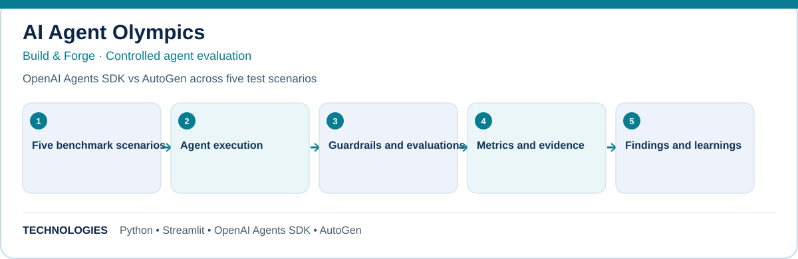

# AI Agent Olympics

**Build & Forge · Controlled agent evaluation**

OpenAI Agents SDK vs AutoGen across five test scenarios.

## What this project explores

- Five benchmark scenarios
- Agent execution
- Guardrails and evaluations
- Metrics and evidence
- Findings and learnings

## Technology

Python · Streamlit · OpenAI Agents SDK · AutoGen

## Documentation

- [README](docs/README.md)
- [EXPERIMENT METHODOLOGY](docs/EXPERIMENT-METHODOLOGY.md)
- [FINAL RESULTS](docs/FINAL-RESULTS.md)
- [DOCKER VPS DEPLOYMENT](docs/DOCKER-VPS-DEPLOYMENT.md)
- [PROJECT GUIDE](docs/PROJECT-GUIDE.md)

## Scope

This repository documents a hands-on build and its engineering learnings. See the linked project guide for implementation details, setup, testing, and any deployment notes. Features and results should be interpreted within the documented project scope.
